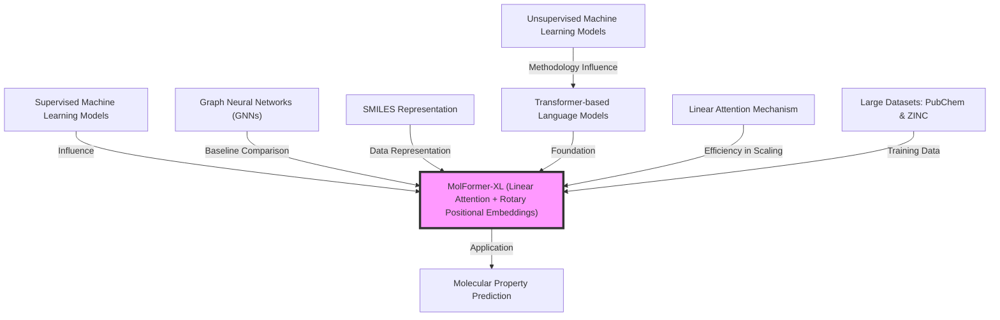

```mermaid
graph TD;
    SupervisedML["Supervised Machine Learning Models"]
    GNNs["Graph Neural Networks (GNNs)"]
    SMILES["SMILES Representation"]
    UnsupervisedML["Unsupervised Machine Learning Models"]
    Transformer["Transformer-based Language Models"]
    LinearAttention["Linear Attention Mechanism"]
    PubChem_ZINC["Large Datasets: PubChem & ZINC"]
    MolFormerXL["MolFormer-XL (Linear Attention + Rotary Positional Embeddings)"]
    PropertyPrediction["Molecular Property Prediction"]
    
    SupervisedML -->|Influence| MolFormerXL
    GNNs -->|Baseline Comparison| MolFormerXL
    SMILES -->|Data Representation| MolFormerXL
    UnsupervisedML -->|Methodology Influence| Transformer
    Transformer -->|Foundation| MolFormerXL
    LinearAttention -->|Efficiency in Scaling| MolFormerXL
    PubChem_ZINC -->|Training Data| MolFormerXL
    MolFormerXL -->|Application| PropertyPrediction

    style MolFormerXL fill:#f9f,stroke:#333,stroke-width:4px
```
