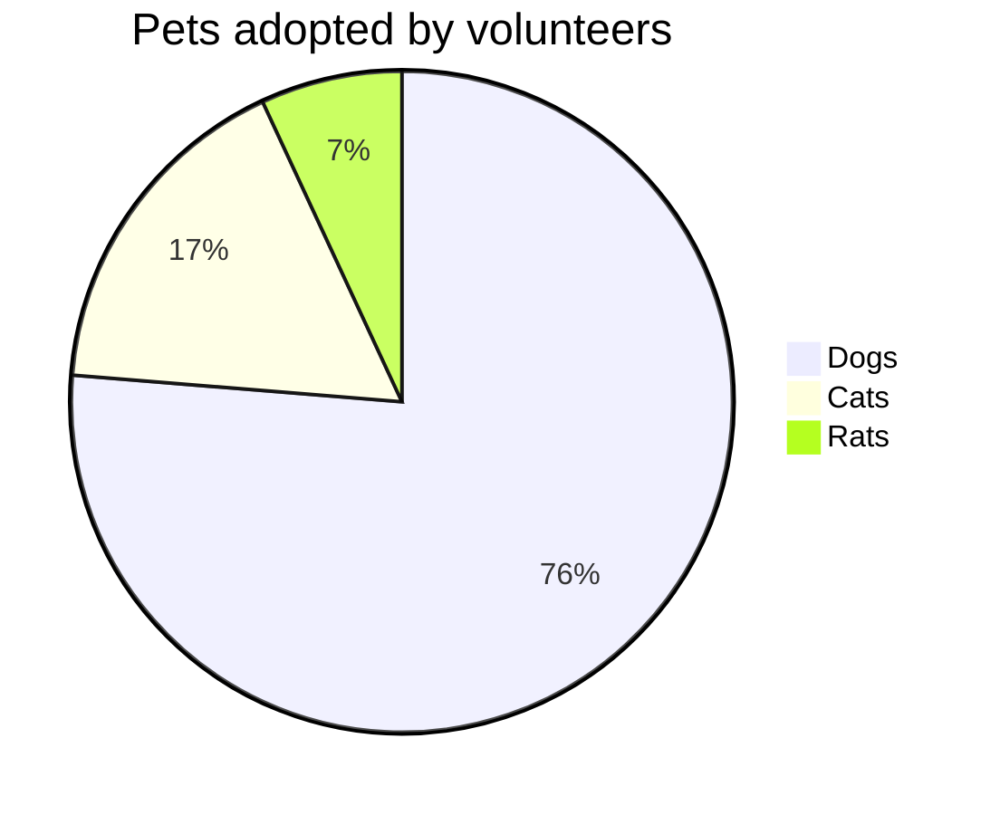
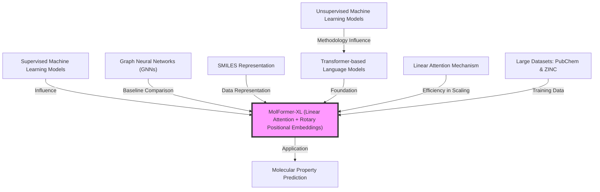

The study highlights the capabilities of the Molecule Transformer (M-Transformer), an unsupervised, pretrained molecular language model that excels in predicting molecular properties from SMILES sequences. This model surpasses traditional graph-based models in various benchmarks, efficiently utilizes computational resources by reducing GPU usage by a factor of 60, and accurately captures interatomic relationships. Further exploration into expanding its applicability beyond small organic molecules is recommended.

MolFormer 
======

Thoughts:
 - Compare to GNN, geometric info missing in Transformer
 - But it enables scale up

