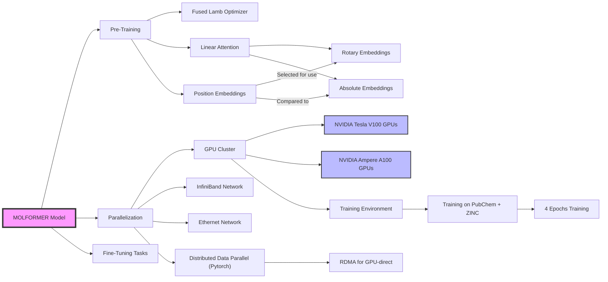
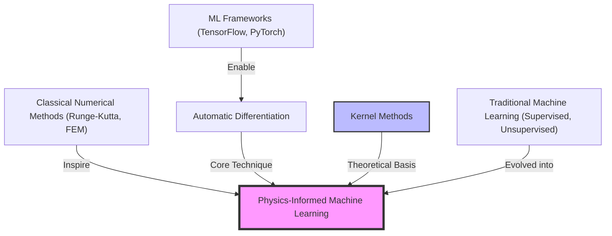
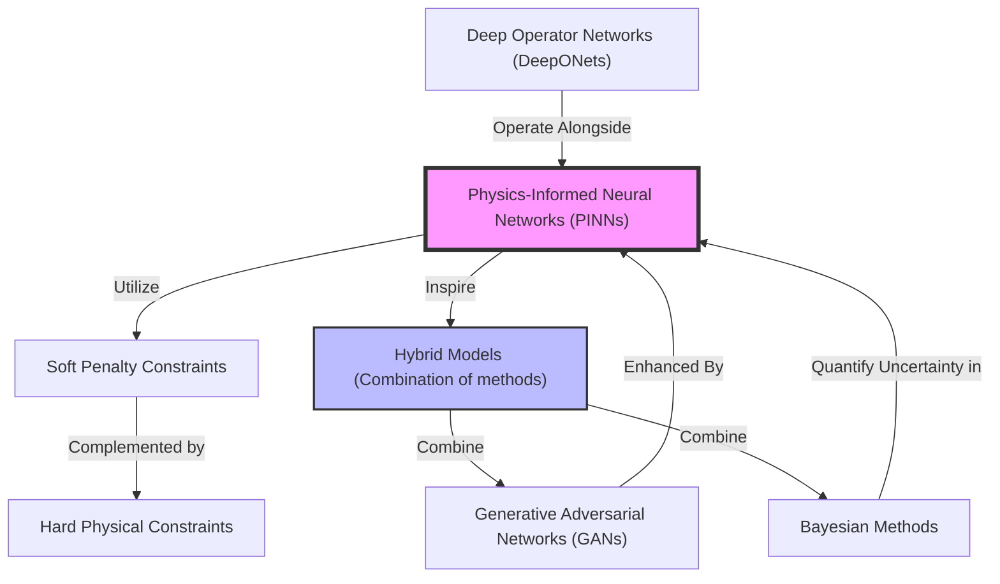
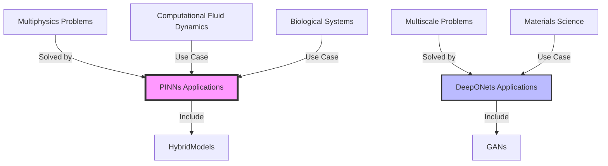

The text discusses the advancements in Physics-Informed Neural Networks (PINNs) facilitated by their integration with modern machine learning libraries such as TensorFlow, PyTorch, and specialized frameworks like DeepXDE and SimNet. PINNs excel in incorporating physical laws into machine learning models, making them particularly adept at handling complex, multidimensional scientific problems.

PINNs 
======

```mermaid!
graph TD;
    SupervisedML["Supervised Machine Learning Models"]
    GNNs["Graph Neural Networks (GNNs)"]
    SMILES["SMILES Representation"]
    UnsupervisedML["Unsupervised Machine Learning Models"]
    Transformer["Transformer-based Language Models"]
    LinearAttention["Linear Attention Mechanism"]
    PubChem_ZINC["Large Datasets: PubChem & ZINC"]
    MolFormerXL["MolFormer-XL (Linear Attention + Rotary Positional Embeddings)"]
    PropertyPrediction["Molecular Property Prediction"]
    Fingerprints["Chemical Fingerprints (e.g., ECFP8)"]
    RNN["Recurrent Neural Networks"]
    MPNN["Message Passing Neural Networks"]
    SchNet["SchNet"]
    DimeNet["DimeNet"]
    ContrastiveLearning["Contrastive Learning (2D Graph Topology and 3D Geometry)"]
    GeomGCL["GeomGCL"]
    GEM["Geometry Enhanced Modeling (GEM)"]
    SelfSupervised["Self-Supervised Learning Models"]
    ChemicalLanguageModel["Chemical Language Models"]
    MLM["Masked Language Model (MLM)"]
    Pretraining["Pretraining on SMILES"]
    FineTuning["Fine-Tuning"]
    QuantumProperties["Quantum Chemical Property Prediction"]
    PhysiologicalProperties["Physiological Property Prediction"]

    SupervisedML -->|Influence| MolFormerXL
    GNNs -->|Baseline Comparison| MolFormerXL
    SMILES -->|Data Representation| MolFormerXL
    UnsupervisedML -->|Methodology Influence| Transformer
    Transformer -->|Foundation| MolFormerXL
    LinearAttention -->|Efficiency in Scaling| MolFormerXL
    PubChem_ZINC -->|Training Data| MolFormerXL
    MolFormerXL -->|Application| PropertyPrediction
    Fingerprints -->|Input Feature for| GNNs
    Fingerprints -->|Input Feature for| RNN
    RNN -->|Molecular Representation| MPNN
    MPNN -->|Include Geometric Data| SchNet
    MPNN -->|Include Geometric Data| DimeNet
    MPNN -->|Traditional Methodology| GNNs
    GNNs -->|Spatial Interaction Modeling| SchNet
    GNNs -->|Spatial Interaction Modeling| DimeNet
    SchNet -->|Influence| MolFormerXL
    DimeNet -->|Influence| MolFormerXL
    UnsupervisedML -->|Contextual Pre-training| GeomGCL
    GeomGCL -->|Performance Improvement| PropertyPrediction
    GEM -->|Modeling Atom-Bond-Angle Relations| PropertyPrediction
    ContrastiveLearning -->|Used in| GeomGCL
    SelfSupervised -->|Used by| MolFormerXL
    ChemicalLanguageModel -->|SMILES Based| MolFormerXL
    MLM -->|Training Technique| MolFormerXL
    Pretraining -->|Large-Scale Data| MolFormerXL
    FineTuning -->|Task-Specific| PropertyPrediction
    PropertyPrediction --> QuantumProperties
    PropertyPrediction --> PhysiologicalProperties

    style MolFormerXL fill:#f9f,stroke:#333,stroke-width:4px
    style SchNet fill:#bbf,stroke:#333,stroke-width:2px
    style DimeNet fill:#bbf,stroke:#333,stroke-width:2px
    style GeomGCL fill:#bbf,stroke:#333,stroke-width:2px
    style GEM fill:#bbf,stroke:#333,stroke-width:2px
    style QuantumProperties fill:#cff,stroke:#333,stroke-width:2px
    style PhysiologicalProperties fill:#cff,stroke:#333,stroke-width:2px
```

Here's a literature note structured in the format you requested, capturing the key discussions on physics-informed neural networks (PINNs) and their integration with machine learning frameworks and numerical methods:

### PINNs and Machine Learning Integration

The text discusses the advancements in Physics-Informed Neural Networks (PINNs) facilitated by their integration with modern machine learning libraries such as TensorFlow, PyTorch, and specialized frameworks like DeepXDE and SimNet. PINNs excel in incorporating physical laws into machine learning models, making them particularly adept at handling complex, multidimensional scientific problems.

**PINNs Framework**
======

### Foundations and Inspirations of Physics-Informed ML

### Physics-Informed Machine Learning Methods

### Applications of Physics-Informed ML

### Thoughts on PINNs and ML Frameworks

1. **Integration with Classical Methods**: 
   - PINNs effectively integrate with classical numerical methods like finite element methods (FEM), boundary element methods (BEM), and finite volume methods (FVM), enhancing their applicability in scientific computing.

2. **Framework Utilization**:
   - Libraries such as DeepXDE and SimNet simplify the application of PINNs by handling complex differential equations and integrating soft penalty constraints that embed physical laws into the training process.

3. **Scalability and Performance**:
   - Hybrid models that combine PINNs with domain decomposition techniques enable scalability and efficient computation across large-scale simulations, supported by parallel computing frameworks.

4. **Advanced Architectures**:
   - The use of meta-learning techniques to automate the configuration of PINNs models presents a forward-looking approach that potentially lowers the barrier to entry for complex model setups.

5. **Future Directions**:
   - **Enhanced Computational Methods**: Further integration with cutting-edge computational techniques such as machine learning-optimized tensor operations could enhance the efficiency of PINNs.
   - **Educational Applications**: Given their structured and intuitive setup, PINNs frameworks are well-suited for educational purposes in computational science and engineering fields.

