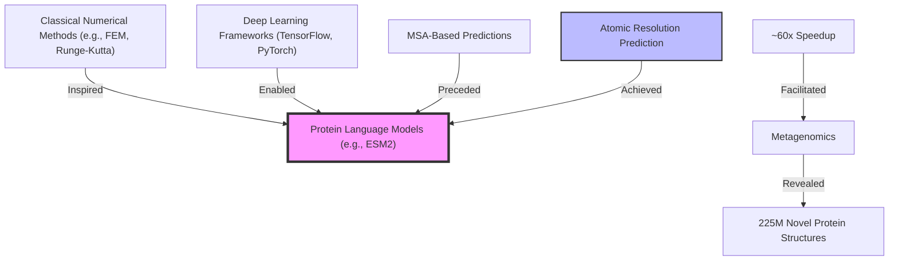

### Introduction

- Traditional protein prediction models rely heavily on evolutionary information, often requiring computationally expensive multiple sequence alignment (MSA) inputs.
- ESM2, powered by large language models (LLMs), learns evolutionary patterns directly from raw protein sequences, eliminating MSA requirements and simplifying the computational pipeline.
- Achieves a ~60x faster inference compared to prior state-of-the-art methods, facilitating studies on vast metagenomic datasets (e.g., MGnify90).

### Atomic Resolution

- Scaled up model parameters from 8M to 15B with a BERT-style masked language modeling objective.
- Experiments demonstrate its capability to predict both low-resolution (contact maps) and high-resolution (atomic-level) structures.
- Highlights that scaling the model enhances its ability to encode and predict protein representations.

### Speed Improvements

- Reduces protein structure prediction time from over 10 minutes to under 1 minute on a single NVIDIA V100 GPU.
- Matches or closely approaches the performance of AlphaFold, achieving significant speedup while maintaining high accuracy.

### Graph: Influence on Protein Prediction Evolution

