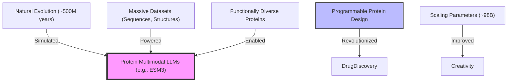

---  
title: 'Literature Notes - ESM3'  
date: 2024-12-25  
permalink: /posts/2024/12/blog-post-esm3/  
tags:  
  - LLM  
  - Protein Evolution  
  - Foundation Model  
---  

- ESM3 pushes the boundaries of protein design by integrating sequence, structure, and function into a single unified framework.  
- It scales up to 98 billion parameters and leverages multimodal inputs, enabling generative design and evolutionary insights.  
- Simulates evolutionary processes, producing proteins equivalent to 500 million years of natural evolution within days.  

### Multimodal Protein Modeling  

- Utilizes three key modalities:  
  - **Sequence**: Captures patterns in amino acid arrangements.  
  - **Structure**: Predicts 3D protein configurations.  
  - **Function**: Designs biologically relevant proteins based on evolutionary goals.  
- Embeds modalities into a shared latent space, allowing flexible and efficient protein generation.  

### Revolutionary Protein Design  

- Demonstrates its generative power with **esmGFP**, a novel fluorescent protein sharing only 58% sequence identity with its closest relative.  
- Empowers programmable protein creation by combining structural motifs and novel scaffolds.  
- Aligns generative outputs with user-specified functional goals using fine-tuning mechanisms.  

### Scalability and Performance  

- Trained on **3.15 billion sequences** and **236 million structures**, with a total of **771 billion tokens**.  
- Largest version contains 216 transformer layers, outperforming smaller models on generative and predictive tasks.  
- Scaling laws of AI emphasize that larger models achieve superior generalization and innovation.  

### Graph: Impact of ESM3 on Protein Design  

### Real-World Applications  

- **Biotechnology**: Synthesis of novel enzymes, biosensors, and therapeutics.  
- **Sustainability**: Engineering proteins for eco-friendly materials and energy solutions.  
- **Basic Science**: Mapping evolutionary trajectories and discovering novel protein functionalities.  

### Closing Remarks  

ESM3 redefines synthetic biology by accelerating protein design and evolutionary studies. Its multimodal capabilities and massive scalability open new horizons in biotechnology, offering tools to tackle humanity's biggest challenges, from medicine to sustainability.  