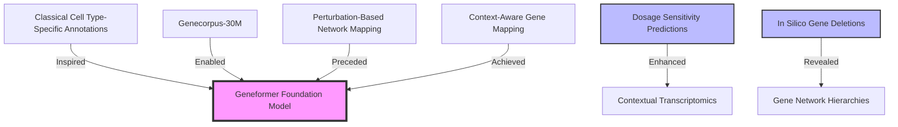

### Introduction

- Traditional methods for analyzing single-cell transcriptomics rely on cell-type-specific annotations or perturbation-based studies, which can be resource-intensive and dataset-specific.  
- Geneformer, a transformer-based foundation model, learns transcriptional dynamics directly from large-scale unlabelled single-cell transcriptomes, enabling **context-aware gene mapping** across diverse cellular states and conditions.  
- Pretrained on Genecorpus-30M (29.9 million single-cell transcriptomes), Geneformer provides a robust framework for a wide range of downstream applications, from dosage sensitivity prediction to in silico gene perturbation analysis.

---

### Context-Aware Gene Mapping

- Each gene is treated as a **unique token** in the model vocabulary, represented by its **ranked expression** within a single-cell transcriptome.  
- Geneformer learns to embed genes into a **256-dimensional space**, encoding both their identity and their context-specific relationships in the cell.  
- Embeddings capture:
  - **Gene interactions** (e.g., regulatory networks).  
  - **Cell state dynamics** (e.g., tissue-specific and developmental roles).  
  - **Contextual importance** (e.g., prioritizing transcription factors in relevant states).  

---

### Applications

#### Dosage Sensitivity Prediction
- Fine-tuned to distinguish dosage-sensitive genes using only 10,000 single-cell transcriptomes, achieving an **AUC of 0.91**, outperforming traditional methods.
- Context-aware embeddings predict tissue-specific dosage sensitivity:
  - **Fetal Cerebral Cells:** Identified high-confidence neurodevelopmental genes with **96% concordance** with prior studies.  
  - **Adult Neurons vs. Fetal Cells:** Highlighted genes with developmental-stage-specific dosage sensitivity.  

#### Network Dynamics Analysis
- Fine-tuned on 30,000 endothelial cells to classify genes as **central (core regulators)** or **peripheral (downstream effectors)** in the NOTCH1-dependent gene network:
  - Achieved an **AUC of 0.81**, outperforming alternative methods.  
  - Successfully predicted network hierarchy without requiring perturbation data.  

#### In Silico Gene Deletion
- Simulated gene deletions by removing genes from the rank-based input:
  - Quantified the impact of deletion on the embeddings of remaining genes.  
  - Identified critical regulatory genes (e.g., GATA4, TBX5) with greater effects on direct vs. indirect targets.  
  - Modeled cooperative effects of gene pairs (e.g., GATA4 and TBX5) with synergistic impacts.  

---

### Pretraining Insights

- **Attention Mechanism:**  
  - Self-attention weights prioritize transcription factors and central regulatory nodes, reflecting their biological importance.  
  - Early attention layers survey diverse gene ranks, while later layers focus on highly ranked, context-critical genes.  

- **Data Efficiency:**  
  - Pretraining on Genecorpus-30M enables generalization to downstream tasks with minimal fine-tuning:  
    - Retained predictive performance even with **5,000 cells** for fine-tuning.  
    - Achieved superior results using only **884 task-relevant cells** compared to larger but less specific datasets.  

---

### Graph: Geneformer’s Role in Single-Cell Analysis

---

### Conclusion

Geneformer represents a paradigm shift in single-cell transcriptomics, leveraging **context-aware embeddings** to analyze gene networks, predict dosage sensitivity, and model perturbations without requiring large-scale perturbation datasets. Its scalability, robustness, and generalizability position it as a transformative tool for studying gene dynamics across diverse biological contexts.